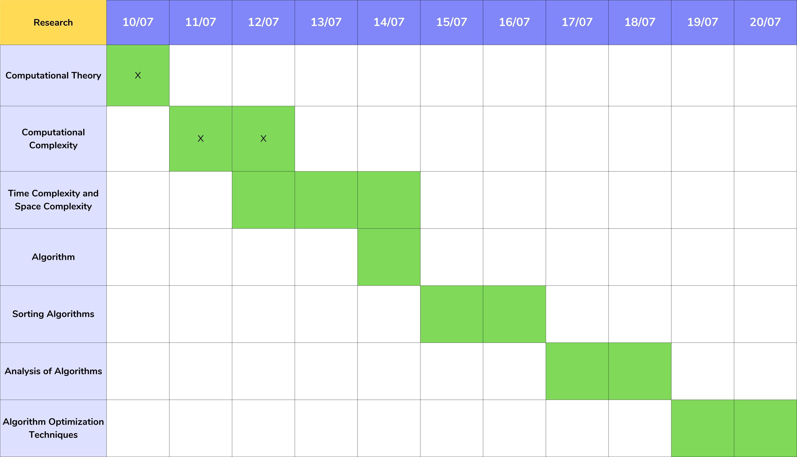

  

<h1 align="center"> Hello! I'm sorry! Working on that! </h1>

# Push Swap

# Summary

This project will make I sort data on a stack, with a limited set of instructions, using
the lowest possible number of actions. To succeed I’ll have to manipulate various
types of algorithms and choose the most appropriate solution (out of many) for an
optimized data sorting.

# Mandatory Part

Rules

  1. I have 2 stacks, named a and b;
  2. At the beginning
      2.1. The stack a contains a random amount of negative and/or positive numbers which cannot be duplicated
       2.2. The stack b is empty.
  3. The goal is to sort in ascending order numbers into stack a. To do so, I have the following operations at Ir disposal

| Code | Name | Description |
|:----:| :---:| :----------:|
| `sa` | (swap a) | Swap the first 2 elements at the top of stack a. Do nothing if there is only one or no elements. |
| `sb` | (swap b) | Swap the first 2 elements at the top of stack b. Do nothing if there is only one or no elements. |
| `ss` | (swap a and swap b) | Do `sa` and `sb` at the same time. |
| `pa` | (push a) | Take the first element at the top of `b` and put it at the top of `a`. Do nothing if `b` is empty. |
| `pb` | (push b) | Take the first element at the top of `a` and put it at the top of `b`. Do nothing if `a` is empty. |
| `ra` | (rotate a) | Shift up all elements of stack `a` by 1. The first element becomes the last one. |
| `rb` | (rotate b) | Shift up all elements of stack `b` by 1. The first element becomes the last one. |
| `rr` | (rotate a and rotate b) | Do `ra` and `rb` at the same time. |
| `rra` | (reverse rotate a) | Shift down all elements of stack `a` by 1. The last element becomes the first one. |
| `rrb` | (reverse rotate b) | Shift down all elements of stack `b` by 1. The last element becomes the first one. |
| `rrr` | (reverse rotate a and reverse rotate b) | Do `rra` and `rrb` at the same time. |
  
# Program

I have to write a program named `push_swap` that takes as an argument the stack `a` formatted as a list of integers. The first argument should be at the top of the stack (be careful about the order)

The program must display the smallest list of instructions possible to sort the stack `a`, the smallest number being at the top.

Instructions must be separated by a `\n` and nothing else.

The goal is to sort the stack with the lowest possible number of operations.

If no parameters are specified, the program must not display anything and give the prompt back.

In case of error, it must display "Error" followed by a `\n` on the standard error. Errors include for example: some arguments aren't integers, some arguments are bigger than an integer and/or there are duplicates.

# Develop

In my case, and because of the multiple things to study, I'll consider 5 weeks of producing this project.

It will be organized like showed in this following image:

        

 

**Tasks**
<ol>
    <li>Research</li>
    <li>Structure</li>
    <li>Code</li>
    <li>Debug</li>
    <li>Validade</li>
</ol>

# Research

In this phase, I'll read about the following topics:

        

<ol>
    <li>Computational Theory</li>
    <li>Computational Complexity</li>
    <li>Time Complexity and Space Complexity</li>
    <li>Algorithm</li>
    <li>Sorting Algorithm</li>
    <li>Analysis of Algorithm</li>
    <li>Optimization of Algorithm</li>
</ol>

## 1. Computational Theory
**What I will learn:**
- **Fundamental Concepts:** Understand the basic models of computation such as Turing machines, finite automata, and grammars.
- **Formal Languages:** Explore different types of formal languages, including regular, context-free, context-sensitive, and recursively enumerable languages.
- **Decidability and Computability:** Learn about problems that can or cannot be solved by algorithms, including the concept of undecidability and the Halting problem.
- **Reductions and Completeness:** Study how problems can be transformed into one another and understand the notions of NP-completeness and co-NP.

## 2. Computational Complexity
**What I will learn:**
- **Complexity Classes:** Understand different complexity classes such as P, NP, PSPACE, and EXP.
- **Problem Hardness:** Learn about problems that are hard or easy for various complexity classes and the implications of these classifications.
- **Hierarchies:** Explore the time and space hierarchy theorems and their implications for computational power.

## 3. Time Complexity
**What I will learn:**
- **Asymptotic Notation:** Understand Big O, Big Omega, and Big Theta notations to describe algorithm efficiency.
- **Time Complexity Analysis:** Learn how to analyze the running time of algorithms and how to compute their time complexity.
- **Worst-case, Best-case, and Average-case Analysis:** Differentiate between these types of analyses and learn how to perform each.
- **Trade-offs:** Explore the trade-offs between time complexity and other factors like space complexity.

## 4. Space Complexity
**What I will learn:**
- **Space Complexity Analysis:** Understand how to analyze the amount of memory an algorithm uses.
- **In-place Algorithms:** Study algorithms that require minimal extra space.
- **Complexity Classes:** Learn about space complexity classes such as L (logarithmic space), NL (nondeterministic logarithmic space), and PSPACE.
- **Trade-offs:** Explore the trade-offs between space complexity and other factors like time complexity.

## 5. Algorithm
**What I will learn:**
- **Algorithm Design:** Understand the principles of designing efficient algorithms.
- **Common Algorithms:** Study a variety of common algorithms for tasks such as searching, sorting, and graph traversal.
- **Algorithm Paradigms:** Explore different algorithmic paradigms such as divide and conquer, greedy algorithms, dynamic programming, and backtracking.

## 6. Sorting Algorithm
**What I will learn:**
- **Basic Sorting Algorithms:** Understand simple sorting algorithms such as Bubble Sort, Selection Sort, and Insertion Sort.
- **Efficient Sorting Algorithms:** Study more efficient algorithms like Merge Sort, Quick Sort, and Heap Sort.
- **Comparison-based vs Non-comparison-based:** Learn the difference between comparison-based sorting and non-comparison-based sorting algorithms like Counting Sort and Radix Sort.
- **Complexity Analysis:** Analyze the time and space complexity of different sorting algorithms and understand their performance characteristics in different scenarios.

## 7. Analysis of Algorithm
**What I will learn:**
- **Performance Metrics:** Learn how to measure and evaluate the performance of algorithms.
- **Complexity Analysis:** Deepen Ir understanding of time and space complexity analysis.

## 8. Optimization of Algorithm
**What I will learn:**
- **Optimization Techniques:** Study techniques to optimize algorithms for better performance.
- **Heuristics and Approximation:** Learn about heuristic methods and approximation algorithms for solving hard problems.
- **Advanced Data Structures:** Explore advanced data structures that can optimize algorithm performance.
- **Parallel and Distributed Computing:** Understand how algorithms can be optimized for parallel and distributed computing environments.

