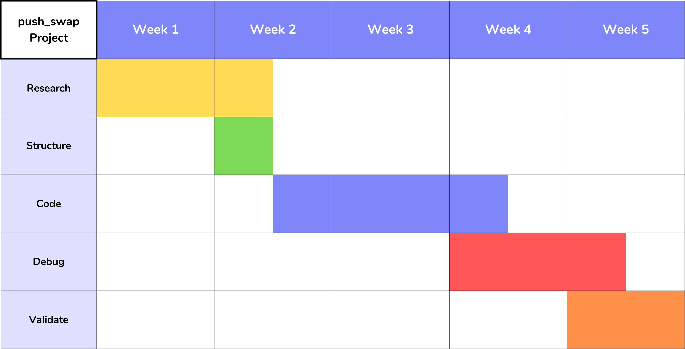

  

<h1 align="center"> Hello! I'm sorry! Working on that! </h1>

# Push Swap

## Summary

This project will make you sort data on a stack, with a limited set of instructions, using
the lowest possible number of actions. To succeed you’ll have to manipulate various
types of algorithms and choose the most appropriate solution (out of many) for an
optimized data sorting.

## Tasks

### Mandatory Part

Rules

  1. You have 2 stacks, named a and b;
  2. At the beginning
      2.1. The stack a contains a random amount of negative and/or positive numbers which cannot be duplicated
       2.2. The stack b is empty.
  3. The goal is to sort in ascending order numbers into stack a. To do so, you have the following operations at your disposal

| Code | Name | Description |
|:----:| :---:| :----------:|
| `sa` | (swap a) | Swap the first 2 elements at the top of stack a. Do nothing if there is only one or no elements. |
| `sb` | (swap b) | Swap the first 2 elements at the top of stack b. Do nothing if there is only one or no elements. |
| `ss` | (swap a and swap b) | Do `sa` and `sb` at the same time. |
| `pa` | (push a) | Take the first element at the top of `b` and put it at the top of `a`. Do nothing if `b` is empty. |
| `pb` | (push b) | Take the first element at the top of `a` and put it at the top of `b`. Do nothing if `a` is empty. |
| `ra` | (rotate a) | Shift up all elements of stack `a` by 1. The first element becomes the last one. |
| `rb` | (rotate b) | Shift up all elements of stack `b` by 1. The first element becomes the last one. |
| `rr` | (rotate a and rotate b) | Do `ra` and `rb` at the same time. |
| `rra` | (reverse rotate a) | Shift down all elements of stack `a` by 1. The last element becomes the first one. |
| `rrb` | (reverse rotate b) | Shift down all elements of stack `b` by 1. The last element becomes the first one. |
| `rrr` | (reverse rotate a and reverse rotate b) | Do `rra` and `rrb` at the same time. |
  
### Program

You have to write a program named `push_swap` that takes as an argument the stack `a` formatted as a list of integers. The first argument should be at the top of the stack (be careful about the order)

The program must display the smallest list of instructions possible to sort the stack `a`, the smallest number being at the top.

Instructions must be separated by a `\n` and nothing else.

The goal is to sort the stack with the lowest possible number of operations.

If no parameters are specified, the program must not display anything and give the prompt back.

In case of error, it must display "Error" followed by a `\n` on the standard error. Errors include for example: some arguments aren't integers, some arguments are bigger than an integer and/or there are duplicates.

### Develop

In my case, and because of the multiple things to study, I'll consider 5 weeks of producing this project.

It will be organized like showed in this following image:

        

Tasks
<ol>
    <li>Research</li>
    <li>Structure</li>
    <li>Code</li>
    <li>Debug</li>
    <li>Validade</li>
</ol>
