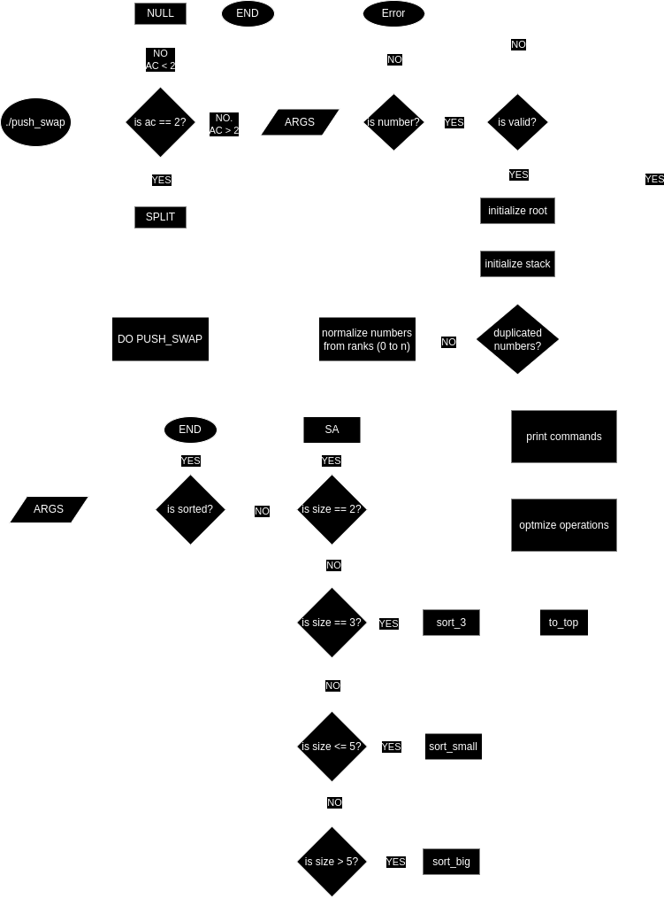
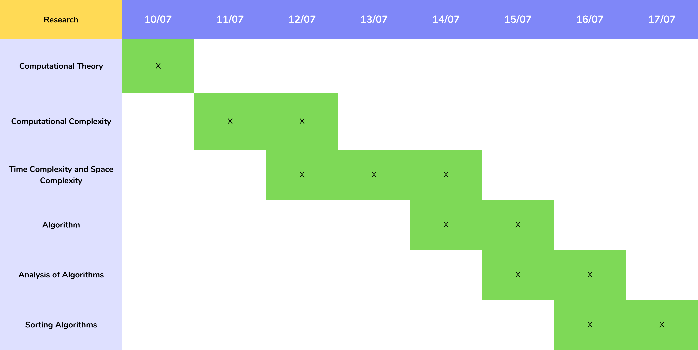

<!-------Push_Swap_Image-------->
<a name="readme-top"></a>
<p align="center">
	
</p>
<!-------About-------->

# About

This project will make I sort data on a stack, with a limited set of instructions, using
the lowest possible number of actions. To succeed I’ll have to manipulate various
types of algorithms and choose the most appropriate solution (out of many) for an
optimized data sorting.

------------
# Index

   <ul>
	<li><strong><a href="#introduction" style="color:white">Introduction </a></strong></li>
	<li><strong><a href="#1-computational-complexity" style="color:white">1. Computational Complexity </a></strong></li>
	<ul style="list-style-type:disc">
		<li><a href="#11-time-complexity-space-complexity-and-big-o-notation"> 1.1. Time Complexity, Space Complexity and Big O notation </a></li>
	</ul>
	<li><strong><a href="#2-sorting-algorithms" style="color:white">2. Sorting Algorithms </a></strong></li>
	<li><strong><a href="#3-push-swap" style="color:white">3. Push Swap </a></strong></li>
	<ul style="list-style-type:disc">
		<li><a href="#31-rules"> 3.1. Rules </a></li>
		<li><a href="#32-program"> 3.2. Program </a></li>	
		<li><a href="#33-develop"> 3.3. Develop </a></li>
		<li><a href="#34-data-structure"> 3.4. Data Structure </a></li>
		<li><a href="#35-push-swap-algorithm"> 3.5. Algorithm </a></li>
		<li><a href="#36-time-complexity-of-my-algorithm-creating-my-own-formula"> 3.6. Time complexity of my algorithm: creating my own formula </a></li>
		li><a href="#37-testing-the-formula"> 3.7. Testing the formula </a></li>
	</ul>
	<li><strong><a href="#4-usage" style="color:white">4. Usage </a></strong></li>
</ul>


# Introduction

Push_swap is a project from 42 school that challenge you to sort a stack using an algorithm, using the lowest possible number of actions. Sound quite straightfoward, right? Well, because it is, indeed. To really understand how to solve this project, or even, how to understand it precisely, we need to see all the topics that surround the project. Specially Complexity and Sorting Algorithms.

# 1. Computational Complexity

Problems come in different varieties, some of then are easy, some are hard. In computers, this the same thing. But what makes some problems computationally hard and other easy? This is the central question of **complexity theory**. Long story short, complexity theory considers not only weather a problem can be solved at all on a computer, but also how **efficiently* the problem can be solved.

To understand the complexity of a problem, researchers developed classes. A complexity class is a set of computational problems of related resouce-based complexity. The two commonly analyzed resources are **time complexity** and **space complexity**. How many steps it takes to perform a computation, and how much memory is required to perform that computation, respectively.

Most complexity classes consist os decision problems that are solvable with a Turing Machine. To measure the complexity, we need to verify if this problem can be solved in **polynomial time**

A **Polynomial Time** algorithm are said to be "fast". Most familiar mathematical operations like additions, subtraction, multiplication and divison as well as computing square roots, power and logarithm can be performed in polynomial time.

Also, in computer science we talk about **deterministic** and **nondeterministic** problems. Determinisitc problems always produce the same output to given input. Non deterministic can exhibit different behaviours and different outputs for the same input.

Problems for wich a deterministic polynomial time algorithm exist belong to the complexity class P, which is central in the field of computational complexity theory. There are many classes, the most important is the P. Those problems that are non deterministic belong to the complexity class NP. Hence, in computational theory and in the computer science field there is a huge discussion on whether P equals to NP. Highly recommended reading more about this.

## 1.1. Time complexity, Space Complexity and Big O notation

Describes the amount of computer time it takes to run an algorithm. The time complexity is commoly estimated by *counting the number of elementary operations performed by the algorithm*. 

Like time, space complexity is the amount of **memory space required to solve an instance of the computational problem**.

Since an algorithm running time may vary among different inputs of the same size, we have the **worst-case time complexity**, **average-case complexity** and **best-case complexity**.

Time and Space complexity is commonly expressed using the **Big O** notation. Typically

$$
O(n), O(nlogn), O(n^a), O(2^n), O(n^2), ...
$$

where n is the size in units of bits needed to represent the input.

Because the exact runnign time of an algorithm is often a complex expression, we usually **estimate it**. In one convenient form of estimation, called **asymptotic analysis** we seek to understand the running time of the algorithm when it is run on large inputs. We also call this the **Big O notation**.

Created by Bachmann and Landov, Big O notation (also know as **Bachmann-Landov notation** or **asymptotinc notation**) represents an algorithm worst-case complexity that defines the runtime required to execute an algorithm by identifying how performance will change as the input size grows.

In Big O, there are six major types of complexities (time and space):

$$
Constant Time = O(1)
$$

$$
Linear Time = O(n)
$$

$$
Logarithm Time = O(nlogn)
$$

$$
Quadratic Time = O(n^2)
$$

$$
Exponential Time = O(2^n)
$$

$$
Factorial Time = O(n!)
$$

As said, we can see the **worst case**, **average case**, **best case**. In asymptotic analysis this is represented as **Big O**, **Big Theta** and **Big Omega** respectively. 

# 2. Sorting Algorithm

A sorting algorithm is an algorithm that puts elements of a list into an order. The most frequently used orders are numerical orders and lexical orders, either ascending or descending.

Formally, the output of any sorting algorithm must satisfy two conditions:

<ul>
	<li>The output is in monotonic order. Each element is not smaller/larger than the previous element</li>
	<li>The output is a permutation. A reordering, yet retaining all of the original elements of the input</li>
</ul>

> [!IMPORTANT]
> For optimum efficiency, the input data should be stored in a data structure which allows random access rather than one that allow only sequential access


# 3. Push Swap

To discuss about my approach on push swap, let's see the mandatory part in this project:

## 3.1. Rules

There are 2 stacks, named A and B. At the beginning the stack A contains a random amount of negative and/or positive numbers which cannot be duplicated and the stack B is empty. The goal is to sort in ascending order numbers into stack a. To do so, I have the following operations at disposal

| Code | Name | Description |
|:----:| :---:| :----------:|
| `sa` | (swap a) | Swap the first 2 elements at the top of stack a. Do nothing if there is only one or no elements. |
| `sb` | (swap b) | Swap the first 2 elements at the top of stack b. Do nothing if there is only one or no elements. |
| `ss` | (swap a and swap b) | Do `sa` and `sb` at the same time. |Explanation Replace all val
| `pa` | (push a) | Take the first element at the top of `b` and put it at the top of `a`. Do nothing if `b` is empty. |
| `pb` | (push b) | Take the first element at the top of `a` and put it at the top of `b`. Do nothing if `a` is empty. |
| `ra` | (rotate a) | Shift up all elements of stack `a` by 1. The first element becomes the last one. |
| `rb` | (rotate b) | Shift up all elements of stack `b` by 1. The first element becomes the last one. |
| `rr` | (rotate a and rotate b) | Do `ra` and `rb` at the same time. |
| `rra` | (reverse rotate a) | Shift down all elements of stack `a` by 1. The last element becomes the first one. |
| `rrb` | (reverse rotate b) | Shift down all elements of stack `b` by 1. The last element becomes the first one. |
| `rrr` | (reverse rotate a and reverse rotate b) | Do `rra` and `rrb` at the same time. |
  
## 3.2. Program

I have to write a program named `push_swap` that takes as an argument the stack `a` formatted as a list of integers. The first argument should be at the top of the stack (be careful about the order)

The program must display the smallest list of instructions possible to sort the stack `a`, the smallest number being at the top.

Instructions must be separated by a `\n` and nothing else.

The goal is to sort the stack with the lowest possible number of operations.

If no parameters are specified, the program must not display anything and give the prompt back.

In case of error, it must display "Error" followed by a `\n` on the standard error. Errors include for example: some arguments aren't integers, some arguments are bigger than an integer and/or there are duplicates.

## 3.3. Develop

To develop this project, I've decided to implement a recursive algorithm using divide and conquer design. The recursive algorithm will increase my complexity, but it will help me deciding which element is needed to sort the stack. Divide and conquer repeatdly reduces an instance of a problem to one or more samller instances of the same problem (recursivelly) until the instances are small enough to be solved easily.

Because using only one sorting algorithm to solve push_swap, I've combined a Twisted Quick-Sort and Insertion Sort. I'll explain in the following.

I've made a flowchart that represents how my program works:

<div aling="center">
        
</div>

## 3.4. Data Structure

To start, we need to create the stacks A and B. I've used arrays to solve this project because sorted arrays are the most space-efficient data structure with the best locality of reference for sequentially stored data. Also, it is very efficient when applied to Quick-Sort. I decided to use a circular array. This is the data struct used:

```C

typedef struct s_stack
{
	char	id;       // Identifier for the stack ('A' or 'B'), used to distinguish between two stacks
	int		*values;  // Pointer to an array of integers representing the elements in the stack
	int		count;    // The current number of elements in the stack
	int		size;     // The maximum capacity of the stack (size of the array)
	int		head;     // Index of the "head" (top) element in the stack
	int		tail;     // Index of the "tail" (bottom) element in the stack
}			t_stack;

```
<ul>
	<ul>
	<li>id: Used to differentiate between two stacks, for example, A and B.</li>
	<li>values: Points to the dynamically allocated array that holds the elements of the stack.</li>
	<li>count: Tracks the current number of elements present in the stack.</li>
	<li>size: Defines the total capacity or maximum size of the stack (the size of the values array).</li>
	<li>head: Keeps track of the top of the stack, allowing efficient push and pop operations.</li>
	<li>tail: Keeps track of the bottom of the stack (sometimes needed for certain operations).</li>
	</ul>
</ul>

Adding to this structure, I've created another one that I call `roots`:

```C

typedef struct	s_ps
{
	t_stack	*a;   // Holds stack A
	t_stack *b;   // Holds stack B
	char	*cmds; // Holds the values of the commands (pa, pb, ra, ...)
}		t_ps;

```

## 3.5. Push Swap Algorithm

To solve push swap I've decided to structure the algorithm in 4 phases:

<ul>
	<li> Phase 1. Parsing and Verify Sanity </li>
	<li> Phase 2. Preparation </li>
 	<li> Phase 3. Sorting Algorithm </li>
	<li> Phase 4. Optimize Commands </li>
</ul>

The **Parsing and Verify Sanity** phase is very self explanatory, we need to get all the tokens (numbers) and verify if they are valid. If everything is correct, we can go to the second phase.

In the Phase 2, **Preparation** we ask first if the quantity of numbers are between 2 and 5. In that case, we jump to the next phase. If not, we're going to create 2 partitions. The smallest are going to B, the biggest stay in A. We need to repeat the process until stack A is empty. After all, we're going to have 4 partitions organized by smallest to biggest numbers. In that case, each element in partition will work almost like a pivot in Quick Sort.

> Example: let's take 10 numbers. We divide by 2. Then we're going to have 2 partitions of 5. If the first number is bigger than the half (5), it must stay because it's part of the big partition, so the command will be `ra`. If the number is smaller than the half, it must go to B, so let's do `pb`. Repeat this until A is empty.

Having a pre-sort in stack B, let's calculate the cost of the best numbers to go to A. This will be the **Sorting Algorithm**, move the number requiring the fewest operations. Repeat this until the partition is empty, then move to the next smaller partition, continuing until stack B is empty. 

>[!TIP]
> There are always 4 movements to push from B to A. That will be `ra` + `rb`, `ra` + `rrb`, `rra` + `rb`, `rra` + `rrb`. All followed by a `pa`. 

Finally, we need to **optimize commands**. Using the root structure `t_ps`, all the commands are contained in `cmds` variable. Now, I've found certains patterns that can optimize the time complexity of my program. Just like, `pb`-`ra`-`pa` = `sa`, `pb`-`pa`-`pb` = `pb`, `sa`-`sb` = `ss`, `ra`-`rb` = `rr`, `rra`-`rrb` = `rrr`. After this, we can print and solve push_swap project! And, voilà! Sorted!

## 3.6. Time complexity of my algorithm: creating my own formula

To better precise my algorithm I have developed a formula to predict the time complexity of my algorithm. To do so, I've used as base the Master Theorem. 

The master theorem is one of the methods for solving recurrence relations arising from divide and conquer algorithms. When a more complex mathematical analysis is required, the master theorem is used, which is an effective tool for this type of situation. In summary, the master theorem solves recurrences that have the following form:

$$
T(n) = aT(n/b) + f(n)
$$

Where n is the data size, the values ​​$`a >= 1`$ and $`b > 1`$ are constants and $`f(n)`$ is a function that represents the time cost of each recursive call of the algorithm.

Considering the chosen sorting algorithm (Quick Sort and Insertion), I couldn't use an unique formula to estimate the complexity of my program. That's because the worst-case complexity for Quick Sort is $`O(nlogn)`$ and Insertion would be $`O(n^2)`$.

In my push_swap, I only use Insertion in 2 specific cases, when we need to sort 3, 4 and 5 numbers. Meaning that the Quick Sort is present in enourmous cases. 

I've said also that I used a 'Twisted' Quick Sort, because I didn't always used a pivot.

Regarding that, in most part of the cases, our worst-case complexity will be:

$$
T(n) = O(nlogn)
$$

Because I am using 2 different stacks, I'll call $A(n)$ and $B(n)$. Translating to Master Theorem, we have:

$$
A(n) = aA(n/b) + B(n)
$$

n is the quantity of elements (numbers) to sort. The values ​​$`a >= 1`$ and $b > 1$ are constants and $B(n)$ is a function that represents the time cost of each recursive call of the algorithm to sort, or finish, the stack B.

Let's find our constants. First of all, as discussed earlier, there are always 4 ways to push from B to A efficiently. Because they're combined with `pa`, is 4 + 1 commands to move a number from B to A. Therefore the number 5 is a constant. I'll call this $`a`$

Another constant is the partitions, which we're always dividing by 2. I'll call this $`b`$

Now, because we need to use 2 stacks to sort, I've decided to make a formula for B, meaning that we will see the complexity to sort B, and then add to A.

$$
B(n) = 2B(n/2) + n/2
$$

The recurrence relation expose the analysis of divide-and-conquer design.

<ul>

<li> $B(n)$: Represent the time complexity required to solve stack B </li>

<li> $2B(n/2)$: Create 2 partitions, each of size $n/2$. Require $B(n/2)$ work to solve, so solving both subproblems together requires $2B(n/2)$ work.</li>

<li> $n/2$: This represents the additional work done at the current level after dividing the problem into smaller subproblems. It might correspond to some linear processing (like merging results or performing operations) that happens after dividing the problem into two parts. </li>

</ul>

The case of the Master Theorem that applies here is when log<sub>b</sub>a = d, which gives a time complexity of $`O(nlogn)`$. The solution to this recurrence has a time complexity of $`O(nlogn)`$ which is what we expected, regarding the Quick Sort Algorithm.

Once we have $`B(n)`$, it's time to see $`A(n)`$

$$
A(n) = aA(n/b) + B(n)
$$

In this formula, it is implied a recursion in $`A(n)`$, which does not happens. The recursion in $`A(n/b)`$ no longer depends on smaller subproblems. Instead, it can be directly resolved into a simpler term, proportional to $`an/b`$.

In this case, we could replace the recursive term $`A(n/b)`$ with its final, non-recursive form, such as $`an/b`$, which gives us:

$$
A(n) = an/b + B(n)
$$


Considering the constants $`a = 5`$ and $`b = 2`$ we have:


$$
a = 5, b = 2
$$

$$
A(n) = 5n/2 + B(n)
$$

Because stack B is the combination of 4 different partitions of numbers in $`n`$, we can say that $`B(n/4)`$

Also, doing this recursively, for each partition, which ultimatelly is 4, we can consider $`4B(n/4)`$.

So the final formula is:

$$
A(n) = 5n/2 + 4B(n/4)
$$

And that is the formula that I developed to analyze the time complexity of my program.

## 3.7. Testing the formula

Let's try with $`n = 100`$

$$
A(n) = 5n/2 + 4B(n/4)
$$

$$
A(100) = 5 x 100/2 + 4B(100/4)
$$

$$
A(100) = 500/2 + 4B(25)
$$

Let's see stack B:

$$
B(n) = 2B(n/2) + n/2
$$

$$
B(25) = 2B(13) + 13 = 2 x 31 + 13 = 75
$$

$$
B(13) = 2B(7) + 7 = 2 x 12 + 7 = 31
$$

$$
B(7) = 2B(4) + 4 = 2 x 4 + 4 = 12
$$

$$
B(4) = 2B(2) + 2 = 2 + 2 = 4
$$

$$
B(2) = 1
$$

Having seen that $`B(25) = 75`$, let's apply in the formula of $`A(n)`$

$$
A(100) = 500/2 + 4B(25)
$$

$$
A(100) = 250 + 4 x 75
$$

$$
A(100) = 250 + 300
$$

$$
A(100) = 550
$$

This means that for 100 numbers, my algorithm will take around 550 movements to sort it!! And it is indeed the results that we can see in my program.

# 4. Usage

First you need to clone the git repository

```bash
$> git clone https://github.com/lude-bri/push_swap_42_LP.git push_swap
```

When finished, follow the instructions:

```bash
$> make
$> ./push_swap <args>
```

The arguments can ONLY be numbers

```bash
$> ./push_swap 0 3 2 1 //individually
$> ./push_swap "0 3 2 1" //or as string
```

The display will look like this

```bash
$> ./push_swap 0 3 2 1
pb
ra
sa
pa
```
Those are the instructions used to sort a stack with elements 0 3 2 1

<!-----------------------------------------------------

# Other

In my case, and because of the multiple things to study, I'll consider 5 weeks of producing this project.

It will be organized like showed in this following image:

<div aling="center">
        
</div>

<br>

**Tasks**
<ol>
    <li>Research</li>
    <li>Structure</li>
    <li>Code</li>
    <li>Debug</li>
    <li>Validade</li>
</ol>

# Research

In this phase, I'll read about the following topics:

<div aling="center">
        
</div>

<ol>
    <li>Computational Theory</li>
    <li>Computational Complexity</li>
    <li>Time Complexity and Space Complexity</li>
    <li>Algorithm</li>
    <li>Analysis of Algorithm</li>
    <li>Sorting Algorithm</li>
</ol>

## 1. Computational Theory
**What I will learn:**
- **Fundamental Concepts:** Understand the basic models of computation such as Turing machines, finite automata, and grammars.
- **Decidability and Computability:** Learn about problems that can or cannot be solved by algorithms, including the concept of undecidability and the Halting problem.
- **Reductions and Completeness:** Study how problems can be transformed into one another and understand the notions of NP-completeness.
- **Bibliography**: [Introduction to the Theory of Computation (Sipser, 2013)](https://mog.dog/files/SP2019/Sipser_Introduction.to.the.Theory.of.Computation.3E.pdf)

## 2. Computational Complexity
**What I will learn:**
- **Complexity Classes:** Understand different complexity classes such as P, NP, PSPACE, and EXP.
- **Problem Hardness:** Learn about problems that are hard or easy for various complexity classes and the implications of these classifications.
- **Hierarchies:** Explore the time and space hierarchy theorems and their implications for computational power.
- **Bibliography**: [Computational Complexity: A Modern Approach(Arora & Barak, 2007)](https://theory.cs.princeton.edu/complexity/book.pdf); [Computational Complexity Theory (Dean, 2015)](https://plato.stanford.edu/entries/computational-complexity/); [Introduction to the Theory of Computation (Sipser, 2013)](https://mog.dog/files/SP2019/Sipser_Introduction.to.the.Theory.of.Computation.3E.pdf); [An Introduction to research in Computational Complexity Theory (Goldberg, 2019)](https://www.seh.ox.ac.uk/blog/an-introduction-to-research-in-computational-complexity-theory)

## 3. Time Complexity and Space Complexity
**What I will learn:**
- **Asymptotic Notation:** Understand Big O, Big Omega, and Big Theta notations to describe algorithm efficiency.
- **Time Complexity Analysis:** Learn how to analyze the running time of algorithms and how to compute their time complexity.
- **Space Complexity Analysis:** Understand how to analyze the amount of memory an algorithm uses.
- **Worst-case, Best-case, and Average-case Analysis:** Differentiate between these types of analyses and learn how to perform each.
- **Bibliography**: [Computational Complexity: A Modern Approach(Arora & Barak, 2007)](https://theory.cs.princeton.edu/complexity/book.pdf); [Introduction to the Theory of Computation (Sipser, 2013)](https://mog.dog/files/SP2019/Sipser_Introduction.to.the.Theory.of.Computation.3E.pdf)

## 4. Algorithm
**What I will learn:**
- **Algorithm Design:** Understand the principles of designing efficient algorithms.
- **Common Algorithms:** Study a variety of common algorithms for tasks such as searching, sorting, and graph traversal.
- **Algorithm Paradigms:** Explore different algorithmic paradigms such as divide and conquer, greedy algorithms, dynamic programming, and backtracking.
- **Bibliography**: [The Art of Computer Programming Volume I: Fundamental Algorithms (Knuth, 1997)](https://www.haiocloud.com/app/uploads/2022/01/The-Art-of-Computer-Programming-Vol.-1-Fundamental-Algorithms-3rd-Edition-by-Donald-E.-Knuth-z-lib.org_.pdf); [Introduction to Algorithms(Cormen, Leiserson, Rivest & Stein, 2022)](https://dl.ebooksworld.ir/books/Introduction.to.Algorithms.4th.Leiserson.Stein.Rivest.Cormen.MIT.Press.9780262046305.EBooksWorld.ir.pdf); [Algorithms in C (Sedgewick, 1998)](https://bioinformatics.netmark.pl/teaching/intro2inf/books/Algorithms%20in%20C%20%283rd%20ed.%29%20Parts%201-4_%20Fundamentals%2C%20Data%20Structures%2C%20Sorting%2C%20Searching%20%5BSedgewick%201997-09-27%5D.pdf)

## 5. Analysis of Algorithm
**What I will learn:**
- **Performance Metrics:** Learn how to measure and evaluate the performance of algorithms.
- **Complexity Analysis:** Deepen Ir understanding of time and space complexity analysis.
- **Bibliography**: [The Art of Computer Programming Volume I: Fundamental Algorithms (Knuth, 1997)](https://www.haiocloud.com/app/uploads/2022/01/The-Art-of-Computer-Programming-Vol.-1-Fundamental-Algorithms-3rd-Edition-by-Donald-E.-Knuth-z-lib.org_.pdf); [Introduction to Algorithms(Cormen, Leiserson, Rivest & Stein, 2022)](https://dl.ebooksworld.ir/books/Introduction.to.Algorithms.4th.Leiserson.Stein.Rivest.Cormen.MIT.Press.9780262046305.EBooksWorld.ir.pdf); [Algorithms in C (Sedgewick, 1998)](https://bioinformatics.netmark.pl/teaching/intro2inf/books/Algorithms%20in%20C%20%283rd%20ed.%29%20Parts%201-4_%20Fundamentals%2C%20Data%20Structures%2C%20Sorting%2C%20Searching%20%5BSedgewick%201997-09-27%5D.pdf)

## 6. Sorting Algorithm
**What I will learn:**
- **Basic Sorting Algorithms:** Understand simple sorting algorithms such as Bubble Sort, Selection Sort, and Insertion Sort.
- **Efficient Sorting Algorithms:** Study more efficient algorithms like Merge Sort, Quick Sort, and Heap Sort.
- **Complexity Analysis:** Analyze the time and space complexity of different sorting algorithms and understand their performance characteristics in different scenarios.
- **Bibliography**: [The Art of Computer Programming Volume I: Fundamental Algorithms (Knuth, 1997)](https://www.haiocloud.com/app/uploads/2022/01/The-Art-of-Computer-Programming-Vol.-1-Fundamental-Algorithms-3rd-Edition-by-Donald-E.-Knuth-z-lib.org_.pdf); [Introduction to Algorithms(Cormen, Leiserson, Rivest & Stein, 2022)](https://dl.ebooksworld.ir/books/Introduction.to.Algorithms.4th.Leiserson.Stein.Rivest.Cormen.MIT.Press.9780262046305.EBooksWorld.ir.pdf); [Algorithms in C (Sedgewick, 1998)](https://bioinformatics.netmark.pl/teaching/intro2inf/books/Algorithms%20in%20C%20%283rd%20ed.%29%20Parts%201-4_%20Fundamentals%2C%20Data%20Structures%2C%20Sorting%2C%20Searching%20%5BSedgewick%201997-09-27%5D.pdf)

----
# Design

In order to solve the problem of the push_swap project, it is needed to make a structure. A consice and clear structure that will guide the program steps.

The Waterfall method is followed in this project. This method consist in following steps sequentially, where each phase depends on the previous one.

It is the best method for this project for two main reasons: scale and structure. It is a small project, in bigger project, with more complex scale, other methods would be more efficient. The structure also it's not complex. I am working in this project solo. If the structure were formed by a group of people, other methods would be more efficient. Not being the case, the waterfall seems adequate 

It is time to see more about the Design phase.

**Initial stage:**
 - parse parameters
 - Creation of a stack A which is a circular doubly linked list (last.next = first; first.prec = last
 - Addition in the struct of a rank component, integer from 1 to n.
This will be much more practical later.

**Phase 1 :**
 - Split the list into 3 (modifiable parameter in the .h).
 - Push the 2 smallest thirds into stack B and do a pre-sort. do ra with others
 - Repeat the operation until there are only 3 numbers left in stack A.
 - Sort these 3 numbers with a specific algo (2 operations maximum)

**Phase2:**
 (Only the ra/rra/rb/rrb commands are used. sa and sb are not used in this phase)
 - Swipe B and look for the number that will take the fewest moves to be pushed into A.
 There are each time 4 ways to bring a number from B to A: ra+rb, ra+rrb, rra+rb, rra+rrb. We are looking for the mini between these 4 ways.
 - Then perform the operation.
 - Repeat the operation until empty B.

**Phase 3:**
- If necessary rot stack A to finalize the correct order. The shorter between ra or rra.
- The optimization comes from the fact of the maximum use of the double rotations rr and rrr

**Explanation**

  Replace all values in a by rank.
    For n = 100, a 3 way split is done:
      ranks 0 to 32 are moved to the bottom of b,
      ranks 33 to 65 are moved to the top of b,
      leaving ranks 66 to 99 in a.

I'm not sure what is meant by "pre-sort" (top | bottom split in b?).
Ranks 66 to 99 in a are sorted, using b as needed.
Ranks from b are then inserted into a using fewest rotates.
    For n = 500, a 7 way split is done:
      Ranks 0 to 71 moved to bottom of b, 72 to 142 to top of b, which will end up in the middle of b after other ranks moved to b.
      Ranks 143 to 214 to bottom of b, 215 to 285 to top of b.
      Ranks 286 to 357 to bottom of b, 358 to 428 to top of b.
      Leaving ranks 429 to 499 in a.

The largest ranks in b are at the outer edges, smallest in the middle, since the larger ranks are moved into sorted a before smaller ranks.
Ranks in a are sorted, then ranks from b moved into a using fewest rotates.
